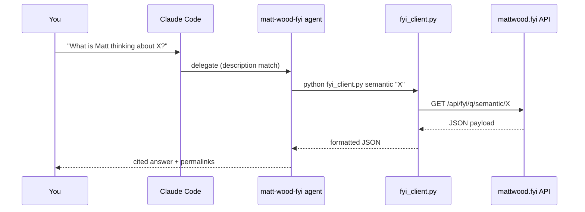

<div align="center">


**Licensed to prompt.** A sandbox repo for Claude Code sub-agents — one field agent deployed so far.


</div>

---

## Mission

`007` is a playground for building and running [Claude Code](https://claude.com/claude-code) sub-agents — small, purpose-built agents with their own instructions and tool access, dispatched automatically based on what you ask for. The codename fits: each agent operates independently, reports back with receipts, and never blows its cover outside the task it was briefed for.

One agent is currently active in the field.

## Agent Dossier

| Codename | Objective | Tools | Status |
|---|---|---|:---:|
| [`matt-wood-fyi`](.claude/agents/matt_wood_fyi.md) | Infiltrate [mattwood.fyi](https://mattwood.fyi/) — the public FYI knowledge graph of AWS Chief AI & Technology Officer Matt Wood — and report back on his current thinking, tensions, and reading | `Bash` | 🟢 Active |
| *classified* | *awaiting deployment* | — | ⚪ Standby |

<details>
<summary><strong>Briefing: matt-wood-fyi</strong></summary>

<br>

Matt Wood runs mattwood.fyi as a live, public, agent-friendly feed of riffs, links, and essay pointers — no auth, no rate limits, and a REST API purpose-built for exactly this kind of querying (`search`, `semantic`, `edges`, `summary`).

The agent doesn't hit that API directly with raw `curl` calls — Windows shell quoting on query strings gets ugly fast. Instead it shells out to [`fyi_client.py`](fyi_client.py), a small wrapper that URL-encodes arguments and returns pretty-printed JSON:

```bash
python fyi_client.py summary
python fyi_client.py search "KEYWORD"
python fyi_client.py semantic "natural language question"
python fyi_client.py edges "SHORT_ID"
```

Ask Claude Code naturally and it delegates based on the agent's `description` field — no explicit invocation syntax needed:

> "What are the latest tensions or challenges Matt is looking at?"

</details>

## How a mission runs



## Quickstart

```bash
git clone <this-repo>
cd 007
```

Open the directory in Claude Code and just ask a question — the agent is already wired up:

> "Use the matt-wood-fyi agent — what does Matt think about the middle class of software engineering?"

> [!NOTE]
> Claude Code reads `.claude/agents/` once at session start. If you edit `matt_wood_fyi.md`, restart your session before the changes take effect.

<details>
<summary><strong>Deploying this agent to a different project</strong></summary>

<br>

1. **Create the agent directory:**
   ```bash
   mkdir -p .claude/agents
   ```
2. **Add the agent file** — copy [`matt_wood_fyi.md`](.claude/agents/matt_wood_fyi.md) into `.claude/agents/` in your target project. The front matter (`name` / `description` / `tools`) must start on line 1 with `---`, or Claude Code won't recognize it.
3. **Add the helper script** — copy [`fyi_client.py`](fyi_client.py) into your project root.
4. **Start a new Claude Code session** in that directory and ask naturally — Claude auto-delegates based on the agent's `description` field.

</details>

---

<div align="center">

*This repository will self-destruct in... never. It's just a sandbox.*


</div>
